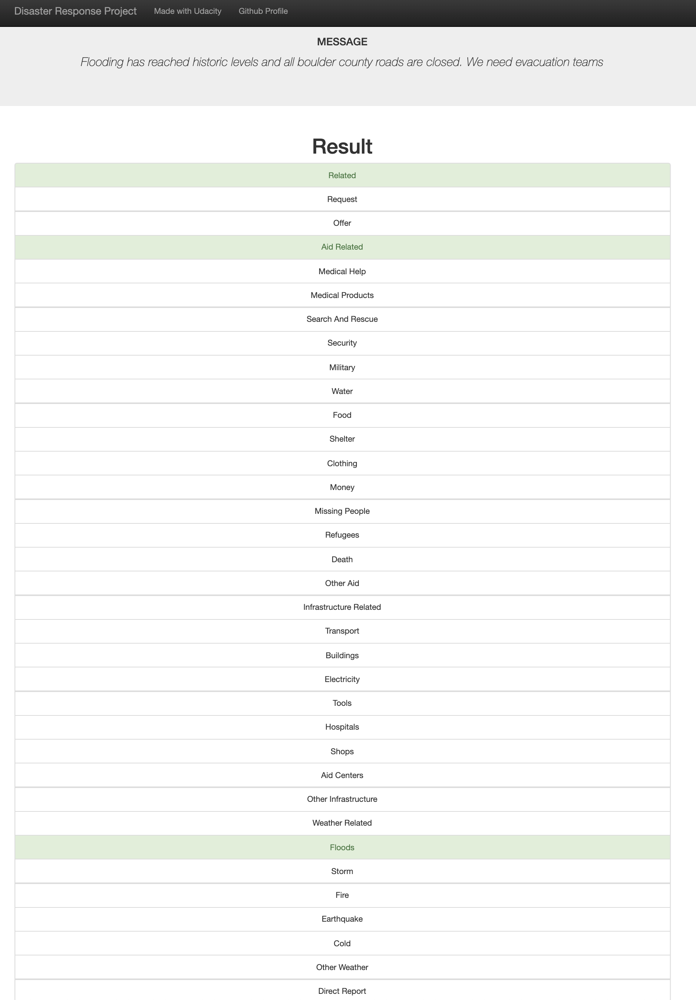
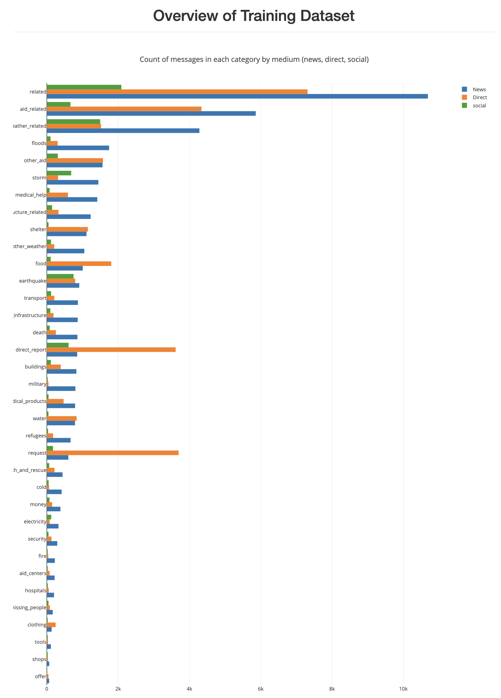
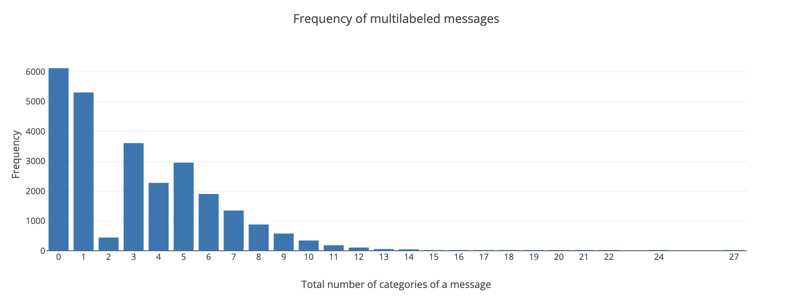

# Disaster Response Project
This project implements a random forest classifier model to categorize messages sent by people during natural disasters. After classification, the messages can be directed to the appropriate disaster relief agency. The training data provided by [Figure Eight](https://appen.com/) was mined using ETL and natural language processing pipelines.

 

The README file includes how to run the Python scripts and web app Comments are used effectively and each function has a docstring.

### Table of contents
1. [Summary](#summary)
2. [File Descriptions](#files)
3. [Usage](#usage)
4. [Discussion on the model's performance and the traning data](#discussion)

## Summary 

In this project we analyze disaster data from [Figure Eight](https://appen.com/) to build a model for an API that classifies disaster messages. 
The data consists of messages from social media, news or disaster response organizations and their corresponding classes (e.g. earthquake, fire, etc.).

The main components of the project are the following:
- ETL Pipeline: Loads the messages and categories datasets, cleans the data, and stores it in a SQLite database
- ML Pipeline: Loads data from the SQLite database, splits the dataset into training and test sets, builds a text processing pipeline, trains and tunes a model using GridSearchCV, outputs results on the test set, exports the final model as a pickle file
- Flask Web App: Displays the results and implements the machine learning model to classify new messages provided by the user. A statistical visualization of the training dataset is provided as well.

## File Descriptions

Here's the file structure of the project:
- app (web application)
  - template
    * master.html (main page of web app)
    * go.html  (classification result page of web app)
  - run.py  (flask file that runs web app)

- data
  - disaster_categories.csv  (training data to process)
  - disaster_messages.csv  (training data to process)
  - process_data.py (ETL script)
  - DisasterResponse.db (database with clean data)

- models
  - train_classifier.py (natural language processing pipeline script)
  - classifier.pkl (saved model)

- notebooks (jupyter notebooks used to develop the source code of the ETL, machine learning pipelines and web application

- README.md

## Usage 

Run the following commands in the project's root directory to set up your database and model.

0. Update and/or synch the versions of python/packages execute:

`pip3 install -U scikit-learn scipy matplotlib`

`pip install --upgrade pip`

1. To run ETL pipeline that cleans data and stores in database:

`python data/process_data.py data/disaster_messages.csv data/disaster_categories.csv data/DisasterResponse.db`

2. To run ML pipeline that trains classifier and saves:

`python models/train_classifier.py data/DisasterResponse.db models/classifier.pkl`

2. Run the following command in the app's directory to run your web app:

`python run.py`

3. Go to http://0.0.0.0:3001/

## Discussion on the model's performance and the traning data 

Consider the message 'Flooding has reached historic levels and all boulder county roads are closed. We need evacuation teams'. Below we see the model's output for this message.

 

The message is labeled as 'related' (related to a disaster), 'aid_related', 'flooding' all of which are accurate. However, it's not labeled as 'search_and_rescue' , 'infrastructure_related', 'weather_related' all of which are sound labels for the type of message entered.

The model's class average precision is 0.74, its recall 0.45, and F1-score 0.51. For example, on the earthquake category the model performes relatively well with precision 0.89, recall 0.68, and F1-score 0.77.  Hence, 89% of the messages labeled by the model as related to earthquakes, were actually related to earthquakes. And, out of all messages related to earthquakes, the model correctly labeled 68% of them. There are categories with precision, recall and F1-scores all equal to zero because this category has a very low support.

Looking at the data more closely and using the following bar graphs it's clear that our dataset is imbalanced. Note that the there's a large number of messages in the training set that don't belong to any of the categories. Moreover, the 'related' category contains high number of messages compared to other categories.

 

After using GridSearch cross validation, the model's parameters were tuned in order to improve its performance. Moreover, in the exploratory phase of this project a K-neighbors model was considered but the results were not better. In a second phase of this project, we can consider techniques to balance the dataset such as over-sampling, down-sampling, or feature selection. 

